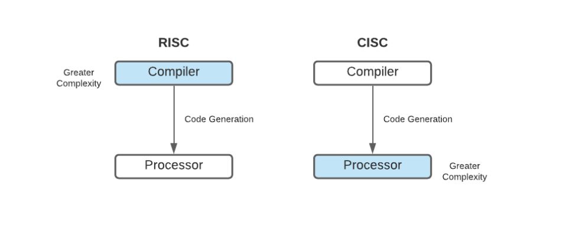

# So sánh Kiến trúc Máy tính: CISC và RISC

---

## 1.1. Khái niệm cơ bản về CISC và RISC

### CISC (Complex Instruction Set Computer - Máy tính có tập lệnh phức tạp)
**CISC** là một kiến trúc vi xử lý với đặc điểm là có một tập lệnh lớn và phức tạp. Mục tiêu ban đầu của CISC là thực hiện các tác vụ cấp cao chỉ bằng một vài lệnh. Ví dụ, một lệnh duy nhất trong CISC có thể thực hiện nhiều hoạt động ở mức độ thấp như tải dữ liệu từ bộ nhớ, thực hiện phép tính và lưu kết quả trở lại bộ nhớ.

### RISC (Reduced Instruction Set Computer - Máy tính có tập lệnh đơn giản hóa)
**RISC** là một kiến trúc vi xử lý được thiết kế để thực hiện một số lượng nhỏ các loại lệnh, với mục tiêu là thực hiện chúng rất nhanh. Mỗi lệnh trong kiến trúc RISC chỉ thực hiện một thao tác rất đơn giản, chẳng hạn như chỉ tải dữ liệu, chỉ tính toán, hoặc chỉ lưu dữ liệu. Các tác vụ phức tạp hơn sẽ được thực hiện bằng cách kết hợp nhiều lệnh đơn giản này.

---

## 1.2. Ưu điểm và Nhược điểm

| Kiến trúc | Ưu điểm | Nhược điểm |
| :--- | :--- | :--- |
| **CISC** | - **Kích thước mã nguồn nhỏ hơn:** Vì một lệnh có thể làm nhiều việc, chương trình viết cho CISC thường ngắn gọn hơn, tiết kiệm không gian bộ nhớ.   - **Lập trình đơn giản hơn (ở cấp thấp):** Lập trình viên Assembly có thể sử dụng các lệnh phức tạp thay vì phải viết nhiều lệnh đơn giản. | - **Thiết kế phần cứng phức tạp:** Vi xử lý cần nhiều mạch logic để giải mã và thực thi các lệnh phức tạp, làm tăng chi phí và mức tiêu thụ điện năng.   - **Hiệu suất không đồng đều:** Các lệnh mất thời gian thực thi khác nhau, gây khó khăn cho việc tối ưu hóa hiệu suất tổng thể. |
| **RISC** | - **Hiệu suất cao và dễ dự đoán:** Hầu hết các lệnh được thực thi trong một chu kỳ xung nhịp duy nhất, giúp tối ưu hóa pipeline và tăng tốc độ xử lý.   - **Phần cứng đơn giản hơn:** Thiết kế vi xử lý đơn giản hơn, dẫn đến chi phí sản xuất thấp hơn và tiêu thụ ít điện năng hơn. | - **Kích thước mã nguồn lớn hơn:** Cần nhiều lệnh đơn giản để thực hiện một tác vụ phức tạp, làm cho chương trình dài hơn và tốn nhiều bộ nhớ hơn.   - **Phụ thuộc nhiều vào trình biên dịch:** Hiệu suất của hệ thống RISC phụ thuộc rất lớn vào khả năng của trình biên dịch trong việc tối ưu hóa mã. |

---

## 1.3. So sánh chi tiết CISC và RISC

| Tiêu chí | CISC (Ví dụ: Intel x86) | RISC (Ví dụ: ARM) |
| :--- | :--- | :--- |
| **1.3.1. Cấu trúc tập lệnh** | Tập lệnh lớn, phức tạp, có nhiều lệnh chuyên dụng. Các lệnh có độ dài thay đổi và nhiều định dạng khác nhau. | Tập lệnh nhỏ, đơn giản và đồng nhất. Các lệnh có độ dài cố định và định dạng đơn giản, dễ giải mã. |
| **1.3.2. Tốc độ xử lý** | Tốc độ thực thi mỗi lệnh không đồng đều, một số lệnh mất nhiều chu kỳ xung nhịp. Khó tối ưu hóa pipeline. | Hầu hết các lệnh được hoàn thành trong một chu kỳ xung nhịp. Rất hiệu quả trong việc sử dụng pipeline để tăng thông lượng. |
| **1.3.3. Kích thước chương trình** | Thường nhỏ hơn vì mỗi lệnh có thể thực hiện nhiều tác vụ. | Thường lớn hơn vì cần nhiều lệnh hơn để hoàn thành cùng một tác vụ phức tạp. |
| **1.3.4. Độ phức tạp phần cứng** | **Rất phức tạp.** Cần các bộ giải mã phức tạp để diễn dịch các lệnh. Nhiều bóng bán dẫn hơn được dành cho logic điều khiển. | **Đơn giản hơn.** Ít mạch logic hơn để giải mã lệnh. Có thể dành nhiều không gian hơn cho các thanh ghi hoặc bộ nhớ đệm (cache). |
| **1.3.5. Ứng dụng thực tế** | Máy tính cá nhân (PC), máy tính xách tay (laptop), máy chủ (server). Các bộ xử lý của **Intel (Core i3/i5/i7/i9)** và **AMD (Ryzen)** là ví dụ điển hình. | Thiết bị di động (smartphone, tablet), hệ thống nhúng, siêu máy tính. Các bộ xử lý **ARM**, **Apple M-series**, và **RISC-V** là các ví dụ phổ biến. |

---

## 1.4. Quan điểm: Kiến trúc nào phù hợp hơn cho hệ thống nhúng hiện nay?

Trong bối cảnh phát triển hệ thống nhúng hiện nay, **kiến trúc RISC được cho là phù hợp hơn** một cách rõ rệt.

### Lý do:

1.  **Hiệu quả năng lượng (Energy Efficiency):** Đây là yếu tố quan trọng nhất đối với các thiết bị nhúng chạy bằng pin (IoT, thiết bị đeo thông minh). Do có thiết kế phần cứng đơn giản, bộ xử lý RISC tiêu thụ ít điện năng hơn đáng kể so với CISC. Kiến trúc ARM đã thống trị thị trường di động chính vì ưu điểm này.

2.  **Chi phí thấp (Low Cost):** Phần cứng đơn giản hơn cũng đồng nghĩa với việc chi phí thiết kế và sản xuất chip thấp hơn. Điều này rất quan trọng đối với các sản phẩm nhúng thường được sản xuất hàng loạt với số lượng lớn.

3.  **Khả năng tùy biến và mở rộng (Customization and Scalability):** Kiến trúc RISC, đặc biệt là các kiến trúc mở như RISC-V, cho phép các nhà thiết kế dễ dàng tùy chỉnh tập lệnh để tạo ra một bộ xử lý tối ưu cho một ứng dụng cụ thể, từ vi điều khiển đơn giản đến các hệ thống trên chip (SoC) phức tạp.

4.  **Hiệu suất trên mỗi Watt (Performance per Watt):** Mặc dù các bộ xử lý CISC hiện đại cũng rất mạnh mẽ, nhưng RISC thường mang lại hiệu suất trên mỗi Watt vượt trội. Trong các hệ thống nhúng, việc cân bằng giữa hiệu suất xử lý và mức tiêu thụ điện năng là cực kỳ quan trọng, và RISC làm điều này tốt hơn.

### Tóm lại
Dù CISC vẫn có chỗ đứng trong các hệ thống cần hiệu năng tính toán thô cực lớn như máy chủ, sự linh hoạt, hiệu quả năng lượng và chi phí thấp của **RISC** đã khiến nó trở thành lựa chọn mặc định và tối ưu cho thế giới đa dạng và phát triển nhanh chóng của các hệ thống nhúng.

---

## Tài liệu tham khảo

1. GeeksforGeeks. (2024). *Difference between RISC and CISC processor*. Lấy từ [https://www.geeksforgeeks.org/computer-organization-architecture/computer-organization-risc-and-cisc/](https://www.geeksforgeeks.org/computer-organization-architecture/computer-organization-risc-and-cisc/)

2. Baeldung. (2023). *RISC vs CISC*. Lấy từ [https://www.baeldung.com/cs/risc-vs-cisc](https://www.baeldung.com/cs/risc-vs-cisc)